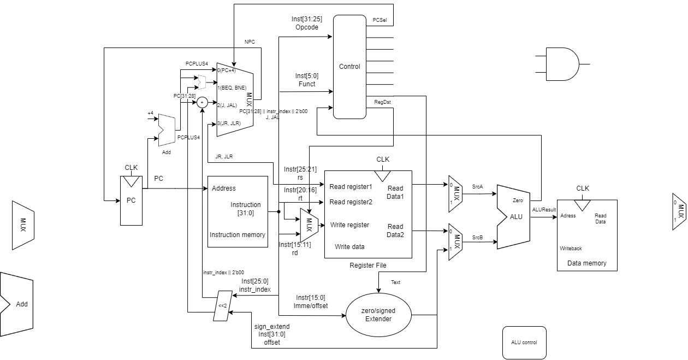

# 单周期指令 MIPS32CPU
设计框图具体设计见文档

# 现在的框架为

## 实现指令（其中指令对应op为序号）

1. `add rd,rs,rt` `R[rs]+R[rt]->R[rd]`
2. `addi rd,rs,imm` `R[rs]+imm->R[rd]` 符号位扩展
3. `addiu rd,rs,imm` `R[rs]+imm->R[rd]` 0扩展
4. `sub rd,rs,rt` `R[rs]-R[rt]->R[rd]`
5. `and rd,rs,rt` `R[rs]&R[rt]->R[rd]`
6. `andi rd,rs,imm` `R[rs]&imm->R[rd]` 
7. `or rd,rs,rt` `R[rs]|R[rt]->R[rd]`
8. `ori rd,rs,imm` `R[rs]|imm->R[rd]` 
9. `nor rd,rs,rt` `~(R[rs]|R[rt])->R[rd]`
10. `nori rd,rs,imm` `~(R[rs]|imm)->R[rd]` 
11. `xor rd,rs,rt` `R[rs]⊕R[rt]->R[rd]`
12. `xori rd,rs,imm` `R[rs]⊕imm->R[rd]` 
13. `beq rd,rs,imm` `if R[rd]==R[rs] then PC=PC+imm<<2` 
14. `beqz rd,imm` `if R[rd]==R[0] then PC=PC+imm<<2` 
15. `bne rd,rs,imm` `if R[rd]!=R[rs] then PC=PC+imm<<2` 
16. `bnez rd,imm` `if R[rd]!=R[0] then PC=PC+imm<<2` 
17. `bgt rd,rs,imm` `if R[rd]>R[rs] then PC=PC+imm<<2` 
18. `bge rd,rs,imm` `if R[rd]>=R[rs] then PC=PC+imm<<2` 
19. `blt rd,rs,imm` `if R[rd]<R[rs] then PC=PC+imm<<2` 
20. `ble rd,rs,imm` `if R[rd]<=R[rs] then PC=PC+imm<<2` 
21. `j imm` `PC=PC(31:28)|imm<< 2` 
22. 
23. `jr rd` `PC=R[rd]`
24. `lb rd,rs` `mem[R[rs]]->R[rd]` 加载一个字节 8bit
25. `lh rd,rs` `mem[R[rs]]->R[rd]` 加载一个半字 16bit
26. `lw rd,rs` `mem[R[rs]]->R[rd]` 加载一个字 32bit
27. `sb rd,rs` `R[rs]->mem[R[rd]]` 储存一个字节 8bit
28. `sh rd,rs` `R[rs]->mem[R[rd]]` 储存一个半字 16bit
29. `sw rd,rs` `R[rs]->mem[R[rd]]` 储存一个字 32bit
30. `slli rd,rs,imm` `R[rs]<<imm->R[rd]`
31. `sll rd,rs,rt` `R[rs]<<R[rt](4~0)->R[rd]`
32. `srli rd,rs,imm` `R[rs]>>imm->R[rd]` 逻辑右移 高位补0
33. `srl rd,rs,rt` `R[rs]>>R[rt](4~0)->R[rd]` 高位补0
34. `srai rd,rs,imm` `R[rs]>>imm->R[rd]` 算数右移 高位补1
35. `sra rd,rs,rt` `R[rs]>>R[rt](4~0)->R[rd]` 高位补1
36. `slt rd,rs,rt` `if R[rs]<R[rt] then R[rd]=1 else 0` 
37. `slti rd,rs,imm` `if R[rs]<imm then R[rd]=1 else 0` 
